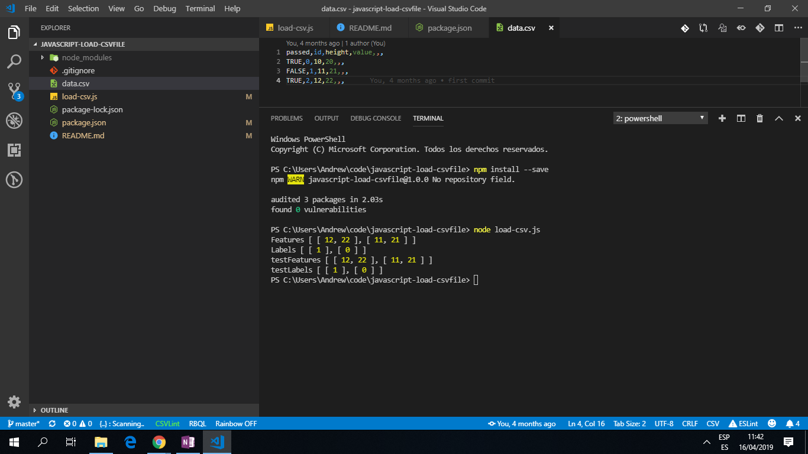

# Javascript Load CSV File

Code to learn to load a Comma Separated Values (CSV) file and manipulate its data. This is part of a Udemy Machine Learning course. The aim of the course is to understand the mathematics and programming techniques that are used in the most common Machine Learning algorithms.

**\* Note: to open web links in a new window use: _ctrl+click on link_**

## Table of contents

- [General info](#general-info)
- [Screenshots](#screenshots)
- [Technologies](#technologies)
- [Setup](#setup)
- [Features](#features)
- [Status](#status)
- [Inspiration](#inspiration)
- [Contact](#contact)

## General info

- This is part of a course on Machine Learning and TensorFlow.

## Screenshots

.

## Technologies

- [node.js v10.15.3](https://nodejs.org).

- [Lodash v4.17.11](https://lodash.com/) Javascript utility library.

- [shuffle-seed v1.1.6](https://www.npmjs.com/package/shuffle-seed) a Nodejs module to Shuffle an Array of records by adding a seed phrase.

## Setup

Use 'node load-csv.js' in terminal to see console.logs or run functions.

## Code Examples

```javascript
// main mapping statement, first row is skipped over,
data = data.map((row, index) => {
	if (index === 0) {
		return row
	}
	//
	return row.map((element, index) => {
		// if there is a converters function then use function to return 'converted'
		if (converters[headers[index]]) {
			const converted = converters[headers[index]](element) // takes boolean TRUE and FALSE values
			return _.isNaN(converted) ? element : converted // if not a number return element
		}

		// parseFloat returns the element and returns a floating point number.
		const result = parseFloat(element) // changes strings to actual number values
		return _.isNaN(result) ? element : result
	})
})
```

## Features

- options can be changed

## Status & To-Do List

- Status: Working code.

- To-Do: add to comments and try a more complex CSV data set.

## Inspiration

- [Udemy Course: Machine Learning With Javascript, Appendix Section 14](https://www.udemy.com/machine-learning-with-javascript/learn/v4/content)

## Contact

Created by [ABateman](https://www.andrewbateman.org) - feel free to contact me!
